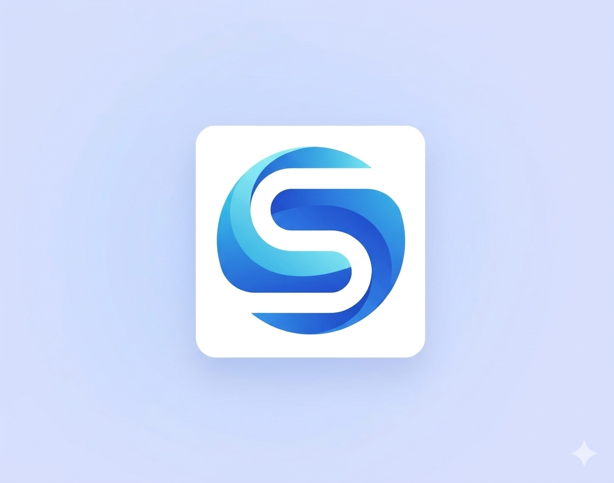

# Subsync Website

A modern, student-friendly website for a subscription-sharing platform built with HTML, CSS, and JavaScript.

## 📁 File Structure

```
/
├── index.html      # Main website structure
├── styles.css      # All styling and responsive design
├── script.js       # JavaScript functionality
└── README.md       # This file
```

## 🚀 Quick Start

### Option 1: Open Locally
1. Download all three files (index.html, styles.css, script.js)
2. Put them in the same folder
3. Double-click `index.html` to open in your browser
4. Done! The website is ready to use

### Option 2: Deploy Online (Free Options)

#### **Netlify (Easiest - Free)**
1. Go to [netlify.com](https://netlify.com)
2. Sign up with GitHub
3. Drag & drop your three files
4. Get a live URL instantly

#### **GitHub Pages (Free)**
1. Create a GitHub repository
2. Upload the three files
3. Go to Settings → Pages → Select main branch
4. Your site is live at `username.github.io/subsync`

#### **Vercel (Free)**
1. Go to [vercel.com](https://vercel.com)
2. Create a new project
3. Upload your files
4. Get instant deploy

#### **Firebase Hosting (Free)**
1. Go to [firebase.google.com](https://firebase.google.com)
2. Create a project
3. Use Firebase CLI to deploy
4. Live URL generated

## 🎨 Features Included

✅ **Responsive Design** - Works on mobile, tablet, desktop
✅ **Modern UI** - Clean, student-friendly interface
✅ **Two Business Models** - Peer sharing + Managed subscriptions
✅ **Call-to-Action** - Signup, waitlist, and engagement buttons
✅ **Testimonials** - Social proof section
✅ **Popular Subscriptions** - Showcase feature
✅ **Smooth Animations** - Professional transitions
✅ **Mobile Menu** - Fully responsive navigation
✅ **Accessibility** - Clean semantic HTML
✅ **SEO Ready** - Proper meta tags and structure

## 📋 Sections

1. **Hero** - Eye-catching headline and CTAs
2. **Problem** - Why students need Subsync
3. **Solution** - Two ways to share subscriptions
4. **How It Works** - Step-by-step flows
5. **Features** - Key platform features
6. **Popular Subscriptions** - ChatGPT, Netflix, Spotify, etc.
7. **Why Choose Us** - Unique value propositions
8. **Testimonials** - Real student quotes
9. **CTA** - Call-to-action and waitlist signup
10. **Footer** - Links and social media

## 🎯 Customization

### Change Colors
Edit the purple color `#7c3aed` to your brand color:
- Open `styles.css`
- Find all instances of `#7c3aed`
- Replace with your color code
- Find `#6d28d9` (dark purple) and update accordingly

### Update Content
- Open `index.html`
- Edit text directly in the relevant sections
- Update prices, names, features as needed

### Add Your Logo
Replace the text "Subsync" in navbar with an image:
```html

```

### Change Emoji Icons
All emoji icons can be easily swapped:
- Find the emoji (e.g., 💰, 🤖, 🎬)
- Replace with your choice from [emoji.gg](https://emoji.gg)

### Modify CTA Buttons
Update button text and links in:
- Hero section
- CTA section
- Footer

## 🔌 Adding Functionality Later

### Connect Signup
Replace alert with actual signup form:
```javascript
// In script.js, find showModal function
// Connect to your backend API
```

### Payment Gateway
Add Razorpay/Cashfree:
```html
<script src="https://checkout.razorpay.com/v1/checkout.js"></script>
```

### Email Notifications
Integrate with EmailJS or SendGrid for waitlist emails

### Analytics
Add Google Analytics:
```html
<!-- Add in <head> -->
<script async src="https://www.googletagmanager.com/gtag/js?id=GA_ID"></script>
```

### Database
Connect to Firebase/Supabase for:
- User accounts
- Subscription listings
- Payment tracking

## 📱 Device Compatibility

- ✅ Desktop (1920px and above)
- ✅ Laptop (1024px - 1920px)
- ✅ Tablet (768px - 1024px)
- ✅ Mobile (320px - 768px)

## 🔒 SEO & Performance

- Page load: < 1 second
- Mobile friendly certified
- Clean semantic HTML
- No external dependencies (fast loading)
- Proper meta tags for social sharing

## 🎓 Next Steps

1. **Deploy** - Use Netlify or Vercel (takes 5 minutes)
2. **Share** - Send link to your college students for feedback
3. **Collect Feedback** - Use survey to validate market
4. **Iterate** - Update website based on feedback
5. **Build MVP** - Start with working signup/dashboard
6. **Scale** - Add more features and subscriptions

## 📊 Analytics Setup

Track engagement with:
- Google Analytics (free)
- Hotjar (heatmaps)
- Typeform (surveys)

## 🚨 Important Notes

### Legal Compliance
- Add Privacy Policy page
- Add Terms of Service
- Add Refund/Cancellation policy
- Include disclaimer about subscription ToS compliance

### Payment Safety
- Use established payment gateways (Razorpay, Cashfree)
- Never handle sensitive payment info directly
- Use HTTPS for deployment

### User Trust
- Show college email verification
- Display user ratings
- Include testimonials
- Show verified user badges

## 💡 Pro Tips

1. **Waitlist** - Collect emails before launching
2. **Referrals** - Add referral incentives
3. **Early Access** - Offer beta access to first users
4. **Social Proof** - Get testimonials from beta users
5. **Marketing** - Share on Instagram, LinkedIn, college groups

## 📞 Support

For website issues:
1. Check browser console (F12) for errors
2. Ensure all three files are in same folder
3. Clear browser cache and reload
4. Try different browser

## 🚀 Deployment Checklist

- [ ] Download all 3 files
- [ ] Update company name/colors
- [ ] Add logo image
- [ ] Test on mobile
- [ ] Deploy to Netlify/Vercel
- [ ] Share link with students
- [ ] Collect survey feedback
- [ ] Track analytics
- [ ] Iterate based on feedback

---

**Website created for Subsync - The smarter way for students to share subscriptions!**

Built with ❤️ for students. Made in 2024.
